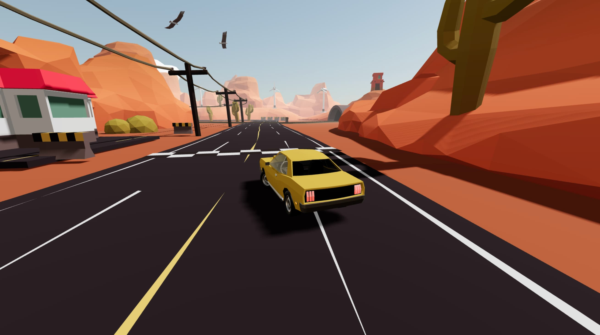

live demo (current state): https://encouraging-ducks.surge.sh

this project is a showcase for the feasibility of react in gaming. we would like to develop it open source, everyone can participate. if you have a pr merged you gain access as a co-contributor/maintainer. :-)

```jsx
/utils    - the app store, helpers
/models   - gltfjsx models, players, characters
/effects  - dust, trails, skids, shaders
/ui       - intros, head up displays, leaderboards
```

there is a dedicated discord channel for this project here: https://discord.gg/poimandres
